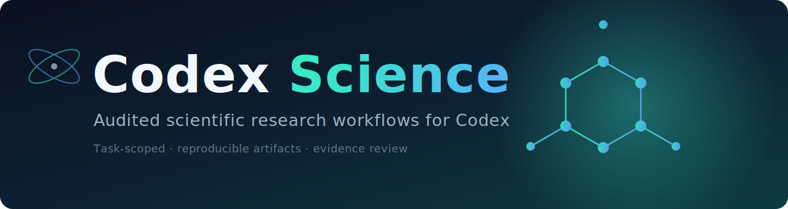

<p align="center">
  
</p>

<p align="center">
  <a href="README.ko.md">한국어</a> ·
  <a href="docs/SETUP.md">Setup</a> ·
  <a href="docs/">Docs</a>
</p>

<p align="center">
  <a href="https://github.com/eightmm/codex-science/actions/workflows/ci.yml"></a>
</p>

Codex Science turns one Codex task into an opt-in scientific workbench: start it once, continue the research workflow across later turns, and stop it explicitly. It routes work to an audited catalog of **187 agent skills** — 149 pinned from [K-Dense-AI](https://github.com/K-Dense-AI/scientific-agent-skills), plus [Codex-native adaptations](authored-skills/) of the entire [Google DeepMind](https://github.com/google-deepmind/science-skills) science set — adds read-only public data tools, and records reproducible artifacts with independent evidence review.

This is an independent Codex plugin inspired by the public workflow of Claude Science. It does not claim parity with any private implementation.

## Install

Install **once** — it registers globally with Codex and works in every project afterward:

```bash
curl -fsSL https://raw.githubusercontent.com/eightmm/codex-science/main/scripts/install.sh | bash
```

Requires a Codex CLI, Git, and Python 3.11+ (the runtime is pure Python standard library). The installer clones into `~/.codex-science`, registers the plugin globally, and is safe to re-run to update.

Then in **any** project, start a new Codex task and say `Start Codex Science`. You do not re-install per project.

<details>
<summary>Manual / development install</summary>

```bash
git clone https://github.com/eightmm/codex-science.git
cd codex-science
./scripts/bootstrap.sh
codex plugin marketplace add "$PWD"
codex plugin add codex-science@codex-science
```

</details>

## Usage

Start the mode once in a new task (English or Korean):

```text
Start Codex Science
Codex Science 시작
```

Continue normally in later turns without naming the skill again:

```text
Find recent primary literature for this hypothesis.
Design the smallest experiment that could disprove it.
Analyze these results and record reproducible artifacts.
Review the final claims against the execution record.
```

Stop it explicitly:

```text
Stop Codex Science
Codex Science 종료
```

An ordinary scientific question in a fresh task does **not** activate the mode. Only three core skills are registered with Codex; the 187 catalog wrappers stay in an internal catalog and load only when the active coordinator selects them.

> Catalog presence is not execution permission. Inactive skills show their audit reasons and require acknowledgement before their upstream instructions can be inspected. See [docs/](docs/) for verification, configuration, and boundaries.

## License

Codex Science's original code is released under the [MIT License](LICENSE).

Imported skills retain their upstream licenses:

- **K-Dense-AI/scientific-agent-skills** — pinned Git submodule; per-skill licenses in each `SKILL.md`.
- **Google DeepMind/science-skills** — vendored under `vendor/gdm-science-skills/`; Apache-2.0 (code) + CC-BY-4.0, with per-source data terms in `SKILL_LICENSES.md` and provenance in `PROVENANCE.md`.

Repository-level files do not override per-skill or dependency licenses.
