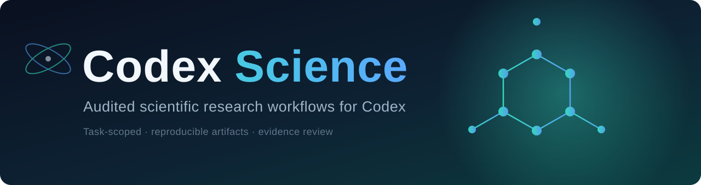

<p align="center">
  
</p>

<p align="center">
  <a href="README.ko.md">한국어</a> ·
  <a href="docs/SETUP.md">Setup</a> ·
  <a href="docs/">Docs</a>
</p>

<p align="center">
  <a href="https://github.com/eightmm/codex-science/actions/workflows/ci.yml"></a>
</p>

Codex Science turns one Codex task into an opt-in scientific workbench: start it once, continue the research workflow across later turns, and stop it explicitly. It routes work to an audited catalog of **283 agent skills** — 149 pinned from [K-Dense-AI](https://github.com/K-Dense-AI/scientific-agent-skills), plus [Codex-native skills](authored-skills/) covering the entire [Google DeepMind](https://github.com/google-deepmind/science-skills) science set, textbook-grounded mathematics and physics, finite statistical decision analysis, agentic life-science evidence synthesis, experimental spectroscopy and analytical chemistry, local and remote scientific compute, Claude Science's publicly documented featured workflows, and current open models such as ESMFold2, ESMC, AlphaFold3, Protenix-v2, SimpleFold, RoseTTAFold All-Atom, RFdiffusion, and BindCraft — adds 34 read-only public data connectors plus local catalog search and research planning, and records reproducible artifacts with independent evidence review.

This is an independent Codex plugin inspired by the public workflow of Claude Science. It does not claim parity with any private implementation.

## Install

Install **once** — it registers globally with Codex and works in every project afterward:

```bash
curl -fsSL https://raw.githubusercontent.com/eightmm/codex-science/main/scripts/install.sh | bash
```

Requires `curl`, a Codex CLI, Git, and either `uv` or Python 3.11+. When `uv` is
available, the installer provisions and records a managed Python 3.12 runtime;
otherwise it uses a compatible `python3`. The hooks and MCP server execute that
recorded interpreter directly, so they do not resolve or download Python on every
invocation. The runtime uses only the Python standard library. The installer
clones into `~/.codex-science`, registers a small stable host bootstrap globally,
prepares a receipt-verified immutable scientific runtime under Codex Science's
private plugin data, and runs a runtime self-check. On a Python 3.8 system,
install `uv` first and then run the same command. Fresh installs are validated in
staging before activation.

An existing installation whose host bootstrap must change needs a one-time
migration. First close every Codex task and quit the Codex app, then explicitly
acknowledge that condition to the installer:

```bash
curl -fsSL https://raw.githubusercontent.com/eightmm/codex-science/main/scripts/install.sh | CODEX_SCIENCE_MIGRATION_ACK=all-codex-tasks-closed bash
```

Do not use that acknowledgement while any Codex task or the app is still open.
Codex can prune an old host cache during registration, so even an inactive open
task must be closed. The installer migrates an older development-checkout
registration transactionally and restores the previous source if replacement
fails. After this bootstrap migration, routine scientific-runtime updates are
automatic and do not re-register the plugin.

Then in **any** project, start a new Codex task, open `/hooks`, and trust the Codex Science `SessionStart`, `UserPromptSubmit`, and `Stop` hooks once. Say `Start Codex Science`; later turns self-invoke the coordinator without another skill mention. You do not re-install per project.

Trust the `Stop` hook too. It reports the saved next action when a run remains
active. Blocking same-turn continuation is temporarily disabled by default
because of the open Codex bug [openai/codex#20783](https://github.com/openai/codex/issues/20783),
which can send a hook-generated local UUID as an API message ID and break the
next request. Hook trust is tied to the exact bootstrap definition. Ordinary
live-runtime updates keep that definition stable; review `/hooks` again only
when the bootstrap definition itself changes.

`/hooks` is the human security boundary: it approves the plugin command but does
not start the science mode. Keep that approval as a deliberate user action. Once
trusted, the plain-language start phrase activates the mode; asking Codex to run
the hook script manually is neither required nor a substitute for hook trust.

<details>
<summary>Development checkout</summary>

```bash
git clone https://github.com/eightmm/codex-science.git
cd codex-science
./scripts/bootstrap.sh
./scripts/check.sh fast
```

Do not register the development checkout as a Codex marketplace. Use it only
for editing and verification; install the runnable plugin with the curl command
above so Codex always loads the managed `~/.codex-science` checkout.

</details>

## Usage

Start the mode once in a new task (English or Korean):

```text
Start Codex Science
Codex Science 시작
```

Continue normally in later turns without naming the skill again:

```text
Find recent primary literature for this hypothesis.
Design the smallest experiment that could disprove it.
Analyze these results and record reproducible artifacts.
Review the final claims against the execution record.
```

### Choose a run mode

Use ordinary task activation for interactive work: trust the three hooks, say
`Start Codex Science` once, then keep working in that same task.

Use native Goal mode when the outcome needs several autonomous continuations. In
a new task, enter `/goal` and use a concrete contract such as:

```text
Start Codex Science.
Goal: reproduce the supplied result and write a reviewed report.
Constraints: use public sources and local CPU only; do not install packages.
Done when: tests pass, every claim has saved evidence, and independent review passes.
```

Codex creates and operates the checkpoint automatically; users do not need to
run `science_checkpoint.py` commands. Goal mode is the outer task lifecycle and
the checkpoint is the recoverable scientific execution record.

One goal-oriented request is enough for a non-trivial run. Codex Science creates
`artifacts/<run-id>/checkpoint.json`, then continues through discovery, execution,
analysis, provenance, and review until the work is complete, genuinely blocked,
or reaches an approval gate. It chooses reasonable defaults for non-blocking
preferences and batches all currently known decisions into one question. The
checkpoint contains control metadata only and is safe to inspect or resume after
context compaction; prompts, credentials, private data, and conclusions are not
stored in it.

For multi-step work, the checkpoint is bound to the current activation's owner
key. The `Stop` hook now warns with the recorded next action but allows the turn
to end, leaving the checkpoint unchanged for the next prompt, resume, or native
Goal continuation. Do not rely on the hook to rescue an early final response;
the coordinator must keep working in the current turn and record a `heartbeat`
after meaningful same-step progress. `approval_required`, `waiting_external`,
and `blocked` remain explicit pause states; `waiting_external` records a polling
interval and terminal rule instead of busy-polling a remote job.

`CODEX_SCIENCE_STOP_MODE=block` restores the legacy blocking path only for
compatibility testing after an installed Codex build includes the upstream fix.
Do not enable it while openai/codex#20783 remains reproducible. In that opt-in
mode, three stop attempts without progress trigger a safety escape,
`CODEX_SCIENCE_MAX_IDLE_CONTINUATIONS=1..20` changes that limit, and every run
still has an absolute continuation budget of 100.

Codex Science does **not** run in the background after the Codex app or task is
closed, and it cannot bypass hook trust, permission prompts, approval gates, or
host availability. `waiting_external` records how to resume safely; it does not
continuously poll while the task is closed.

In native Goal mode, hooks cannot call or observe Goal tools, so the coordinator
performs the bridge on each automatic continuation. Completion is intentionally
ordered: satisfy all schema-v4 criteria with run-local evidence, pass an
independently attested review, enter `completion_pending`, complete the native
Goal, and save a hashed run-local completion receipt. These are coordinator
internals, not extra user commands. The receipts are auditable agent evidence;
hooks do not authenticate the host or reviewer identity. Do not combine Codex
Science with another generic or Ralph-style `Stop` loop; competing guards can
prevent a task from terminating.

Agentic life-science examples:

```text
Interpret rs7903146 for type 2 diabetes across FinnGen, BioBank Japan, and UKB/TOPMed.
Prioritize genes at this asthma locus using genetics, eQTL, expression, and pathway evidence.
Find reusable public proteomics and microbiome datasets for this hypothesis, then rank them by study-design fitness.
```

Codex Science normalizes identifiers first, retrieves only the required evidence
lanes, records source releases and exact queries, reconciles conflicts, and runs
independent review. See [agentic life-science source coverage](docs/LIFE_SCIENCE_RESEARCH_SOURCES.md).
The checked-in [PheWAS acceptance run](examples/life-science-reviewed-run/)
demonstrates bounded live retrieval, a pinned evidence snapshot, conservative
genome-build handling, deterministic analysis, artifact hashes, and review.
Public API drift runs weekly and on manual dispatch in a separate workflow, so
temporary upstream outages do not block pull-request CI.
Reactome currently rejects GitHub-hosted runner IPs with HTTP 403; that single
environment block is reported explicitly in scheduled runs, while every other
source/status failure remains fatal. Local `scripts/check.sh public` stays strict.

Activation is keyed to Codex's `session_id` plus a random generation stored in a
private marker; the raw session ID, prompt, and research data are never stored.
The derived owner key binds one nonterminal checkpoint to that activation only,
so another task or a later activation cannot inherit its Stop guard. Resume and
context compaction preserve the generation. Explicit stop or `clear` marks the
discoverable owned nonterminal run `abandoned`, removes the marker, and the next
activation creates a new generation and owner key. Rotation prevents an old run
from regaining the guard even when its artifact is no longer discoverable.
Activation markers expire after 180 days of inactivity. If the
`SessionStart`, `UserPromptSubmit`, and `Stop` hooks have not all been trusted,
same-task conversation continuity remains a best-effort fallback, and
resume/compaction context plus the active-checkpoint warning are not guaranteed.

Stop it explicitly:

```text
Stop Codex Science
Codex Science 종료
```

## Updates

Older installations need the acknowledged bootstrap migration shown above.
After that, the default `apply` mode checks the official GitHub `main` branch at
`SessionStart` and again on the first Codex Science activation when needed.

A clean, official fast-forward candidate is classified before any candidate code
runs. A compatible scientific-runtime change must advance `runtime_version`,
preserve the stable host-bootstrap bytes and policy, keep the MCP discovery
contract compatible, and pass the complete candidate gate. It is then installed
append-only under
`$CODEX_HOME/plugins/data/codex-science-codex-science/runtime-cache/<runtime_version>`;
this project-owned store is independent of Codex's prunable plugin cache.
Automatic and ordinary explicit runtime updates never call `codex plugin`, edit
Codex plugin registration, or replace the host bootstrap.

First activation pins the generation to an exact runtime commit and receipt.
Later hooks, Stop checks, skills, and MCP calls do not switch when another task
installs a release. The first MCP tool call uses Codex task metadata to bind the
connection to the same pin after checking the advertised tool contract.
Checkpoints and artifact manifests record that runtime identity; `runtime_span`
is a defensive warning for legacy or recovery transitions rather than the normal
update path.

If a candidate changes bootstrap files, bootstrap policy, or the host
`plugin_version`, automatic update stops before running it and asks for the
acknowledged curl migration. The plugin version shown by Codex identifies this
stable host bootstrap; it is not the scientific `runtime_version`. Open a new
task to adopt a newly installed runtime or, after a bootstrap migration, to load
and review the new hook definition.

Choose the startup behavior before launching Codex:

| `CODEX_SCIENCE_AUTO_UPDATE` | Session start / first activation | Explicit update request |
| --- | --- | --- |
| `apply` (default) | Verify and install a compatible runtime for activation | Install a compatible runtime for new activations; keep an active run pinned |
| `notify` | Report only | Install a compatible runtime for new activations; keep an active run pinned |
| `off` | Skip | Install a compatible runtime for new activations; keep an active run pinned |

An explicit request works in every mode:

```text
Codex Science 업데이트
Update Codex Science
```

If the network is unavailable, another update owns the lock, the managed checkout
is dirty or unofficial, ancestry diverges, or validation fails, Codex Science
keeps the last-known-good verified runtime and reports the reason. It never
silently overwrites a development checkout. Re-run the installer only when the
message asks for migration or repair.

## Verify and troubleshoot

Confirm that Codex sees the stable host bootstrap:

```bash
codex plugin list
```

The `codex-science@codex-science` row should say `installed, enabled`. If the
mode does not activate, open a **new** Codex task, inspect `/hooks`, trust all
three Codex Science hooks, and use exactly `Start Codex Science` or
`Codex Science 시작`. An inactive task can use the verified update on first
activation; an already active task deliberately keeps its prior pin. Open a new
task to start on the installed scientific runtime. After an acknowledged
bootstrap migration, open a new task and review and trust the new hook definition.

For a development checkout, run:

```bash
./scripts/check.sh fast    # offline unit, catalog, plugin, and skill validation
./scripts/doctor.sh        # checkout, submodule, catalog, and environment diagnosis
./scripts/check.sh public  # optional live public-source smoke test
```

Do not run `codex plugin marketplace add "$PWD"` from this repository. The curl
installer owns the `codex-science` marketplace registration and points it at
`~/.codex-science`.

See [Setup](docs/SETUP.md) for path overrides and installation details and
[Checkpoints](docs/CHECKPOINTS.md) for the state and recovery contract.

## Scientific computer use

Inside an active task, Codex Science can inspect and use the available computer
for local shell, Python, R, Julia, Jupyter, containers, CPU, and GPU workflows.
It can also use an existing SSH host, Slurm/HPC cluster, cloud GPU account, or
private object store when the task requires remote compute. GUI/browser desktop
automation is intentionally outside this workflow.

Read-only inspection and small work in an existing environment can proceed
directly. Before installing packages, contacting a new host, transferring private
data, submitting a remote job, or allocating paid resources, Codex presents one
approval packet with the target, data movement, resources, time/cost cap, output
path, and cancellation plan. Approved reversible steps then continue without
repeated prompts. Commands, environments, job IDs, logs, exit status, costs, and
output hashes are recorded under `artifacts/<run-id>/`; credentials are never
stored there. See [Scientific compute](docs/COMPUTE.md) for the complete boundary.

Each completed run also gets a local `index.md` and, when requested, an offline
`index.html`. Primary PNG/JPEG/WebP/GIF results are displayed directly in the
Codex conversation; reports, tables, notebooks, logs, and secondary figures are
returned as clickable absolute-path links. No web deployment is required.

An ordinary scientific question in a fresh task does **not** activate the mode. Only three core skills are registered with Codex; the 283 catalog wrappers stay in an internal catalog and load only when the active coordinator selects them.

> Catalog presence is not execution permission. Inactive skills show their audit reasons and require acknowledgement before their upstream instructions can be inspected. See [docs/](docs/) for verification, configuration, and boundaries.

## Catalog

All skills merge into one deterministic, audited inventory (`catalog/inventory.json`) from three tiers:

- **K-Dense-AI — 149** · pinned upstream (Git submodule); thin Codex wrappers point at the pinned instructions.
- **Codex-native authored — 131** · the entire Google DeepMind science set [rewritten as first-class Codex skills](authored-skills/), textbook-grounded mathematics/physics and finite statistical decision analysis, agentic life-science source and synthesis workflows, a protocol-driven literature-review conductor, six spectroscopy and analytical-chemistry workflows, local/remote scientific computing, and isolated, gated execution workflows for current structure, protein/genome, docking, design, MD, and single-cell models. Concrete-problem runners continue through solution, independent checks, provenance, and review. Thirty-four public sources plus local catalog search and life-science planning are callable through the plugin's read-only MCP (`science_search_*`, `science_plan_*`). See [life-science source coverage](docs/LIFE_SCIENCE_RESEARCH_SOURCES.md).
- **DeepMind infra — 3** · `credentials`, `uv`, `workflow_skill_creator`, kept as pointers.

A conservative audit marks each skill **active** or **inactive** (by license, executable content, credential need, and safety). Inactive skills stay in the catalog but require explicit acknowledgement before use.

`doctor.sh` validates every Codex-native source and generated wrapper, verifies pinned source integrity, and checks that natural skill names remain discoverable. Wrappers for upstream instructions over 500 lines use heading-first progressive loading instead of loading the whole source tree by default.

## License

Codex Science's original code is released under the [MIT License](LICENSE).

Imported and adapted skills retain their upstream licenses:

- **K-Dense-AI/scientific-agent-skills** — pinned Git submodule; per-skill licenses in each `SKILL.md`.
- **Google DeepMind/science-skills** — Apache-2.0 + CC-BY-4.0. The science skills are adapted into Codex-native form under `authored-skills/` (attribution in each `SKILL.md`); the pinned upstream copy under `vendor/gdm-science-skills/` keeps the original `LICENSE`, `SKILL_LICENSES.md`, and `PROVENANCE.md`.
- **Open mathematics and physics texts** — source URLs, exact cached-file hashes, licenses, exclusions, and the no-PDF-in-Git policy are recorded in [`docs/TEXTBOOK_SOURCES.md`](docs/TEXTBOOK_SOURCES.md). The resulting skills are independently written procedural syntheses, not textbook copies.
- **Analytical chemistry standards and tools** — official sources, overlap boundaries, and modality-specific evidence rules are recorded in [`docs/ANALYTICAL_SOURCES.md`](docs/ANALYTICAL_SOURCES.md).

Repository-level files do not override per-skill or dependency licenses.
