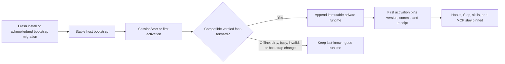

# Codex Science platform contracts

This document is the operational contract for release identity, public-source retrieval, scientific evidence, review, model execution, SBDD acceptance, artifact collaboration, and update safety.

## Release identity

Codex Science uses one release identity module: `src/codex_science/version.py`.

- Python package: `0.5.0`
- MCP server: `0.5.0`
- Stable host-bootstrap version: `0.5.0+codex.20260803040515`
- Scientific runtime version: `0.5.0+codex.20260803040515`
- Machine-readable release record: `release/manifest.json`

Run:

```bash
python scripts/validate_release.py
```

A runtime-affecting change requires a monotonically newer `runtime_version`. A
host-bootstrap file or bootstrap-policy change additionally requires a
monotonically newer `plugin_version` and cannot be applied automatically.
Cache-neutral changes need neither version bump. The stable dispatcher can use a
verified compatible runtime on first activation in the initiating task. Once
active, that generation stays on its immutable runtime commit and receipt; a new
Codex task can start on the latest installed runtime without replacing the host
bootstrap.

Fresh installs call `scripts/bootstrap.sh`, initialize the pinned skill catalog,
register the stable host bootstrap, and seed the project-owned runtime store.
When a later release changes that bootstrap, every Codex task and the app must be
closed before running the curl installer with
`CODEX_SCIENCE_MIGRATION_ACK=all-codex-tasks-closed`. After that migration, the
stable hook dispatcher and MCP proxy resolve a verified runtime from
`$CODEX_HOME/plugins/data/codex-science-codex-science/runtime-cache/`;
`scripts/science_update_entry.py` preserves the transactional candidate contract
before activation without invoking Codex plugin registration.

## Pinned runtime lifecycle



`CODEX_SCIENCE_AUTO_UPDATE=apply` is the default. `notify` reports a candidate
without applying it automatically, and `off` skips lifecycle checks. An explicit
`Codex Science 업데이트` request verifies and installs a compatible runtime in
every mode. Neither path calls `codex plugin`; bootstrap changes stop with an
instruction to use the acknowledged curl migration. If a run is already active,
the install is reserved for new activations and the current generation remains
pinned. On the first MCP `tools/call`, Codex's session metadata selects that same
pin; initialize and tool-list contracts are replayed before a handoff. Every
checkpoint and artifact-manifest write appends the runtime identity.
`runtime_span` remains a reviewable defense against legacy or recovery
transitions, not routine automatic updating.

## Complete candidate gate

Run:

```bash
python scripts/candidate_contract_check.py
```

The gate verifies:

1. independent host-bootstrap and scientific-runtime identities, monotonic bumps, and cachebuster syntax;
2. Connector Contract v2 registry, legacy connector compatibility, snapshot replay, and typed parser fixtures;
3. Python compilation;
4. deterministic skill inventory and generated wrappers;
5. legacy and v2 model registries;
6. reviewer benchmark safety metrics;
7. deterministic executable SBDD acceptance;
8. hash-valid artifact bundle and passed record review.

It is deliberately bounded and uses only deterministic local fixtures after the pinned submodule is present.

## Connector Contract v2

Material source retrieval should use the MCP tool `science_query_source_v2`. Existing `science_search_*` tools remain available for compatibility and quick discovery.

A v2 request contains:

```json
{
  "source": "pubmed",
  "operation": "search",
  "parameters": {"query": "protein folding"},
  "page_size": 5,
  "max_pages": 1,
  "evidence_cutoff": "2026-07-19",
  "source_contract_version": "2"
}
```

The response contains normalized records plus a receipt with:

- deterministic query ID and canonical request SHA-256;
- source, operation, contract version, and source release when exposed;
- query status and completeness state;
- each contacted URL and HTTP method;
- request-body hash for POST operations;
- response SHA-256, media type, timestamp, cursor, and record count;
- normalized-record SHA-256;
- explicit missingness, exclusions, and warnings.

Use `include_snapshot: true` only when a replayable raw response snapshot is required. Snapshots must not contain credentials or secret-bearing URLs.

`evidence_cutoff` is enforced only by typed source implementations. Legacy search adapters reject a cutoff instead of silently returning evidence outside the requested boundary.

### Offline replay and drift

```bash
python scripts/replay_connector_snapshot.py snapshot.json
python scripts/connector_drift_report.py previous.json current.json --output drift.json
```

Drift types are:

- `schema-drift`
- `pagination-drift`
- `release-drift`
- `response-drift`
- `semantic-drift`

The scheduled `Public API drift` workflow separately reports operational state as `healthy`, `environment-blocked`, `transient-failure`, `degraded`, `unavailable`, or `semantic-drift`. It restores the most recent branch state from the Actions cache and stores JSON, Markdown, and next-state receipts as a GitHub Actions artifact. Reactome HTTP 403 from a hosted runner remains an explicit environment block; other semantic drift, degradation, or unavailability fails the workflow.

### Source maturity

Run the MCP tool `science_list_source_contracts` to inspect each source's maturity and query semantics. The registry distinguishes live-smoke-tested sources from fixture-tested experimental adapters and versioned-snapshot contracts. Catalog presence does not imply that every source has a stable live API.

## Evidence graph v2

Attach a graph as an artifact with kind `evidence-graph-v2`.

Supported relationships include:

- `supports`
- `contradicts`
- `depends_on`
- `duplicates`
- `derived_from`
- `shares_cohort`
- `shares_samples`
- `propagated_from`
- `training_overlap`

The validator enforces relation-specific node types and rejects cycles in `depends_on`, `derived_from`, and `propagated_from` chains.

Independence is computed from connected components formed by duplication, derivation, shared cohorts or samples, portal propagation, and training overlap. Two support edges in one dependency component are one effective evidence group, not two replications.

## Review receipt contract

A hash-covered review artifact uses kind `review-receipt-v2`, or kind `review-receipt` with the new fields present. Legacy review receipts remain readable and are not reinterpreted as v2 receipts.

Required semantics include:

- review ID and reviewer;
- procedural independence statement;
- review modes: `record`, `source`, `method`, or actual `reproduction`;
- status;
- artifact paths and exact SHA-256 values covered by the review;
- covered claim IDs;
- optional model-registry SHA-256;
- findings, limitations, and deterministic receipt fingerprint.

The receipt becomes stale when a covered artifact is missing or changed, or when its covered model registry changes. A receipt cannot be `passed` while an unresolved critical or major finding remains.

## Reviewer benchmark

Run:

```bash
python scripts/run_reviewer_benchmark.py --require-safe
```

The checked-in corpus covers:

- valid evidence graphs;
- invalid source/target relation types;
- dependency cycles;
- hidden shared-cohort dependence;
- stale review receipts;
- unsafe passed receipts.

Metrics include critical recall, major recall, severity-weighted precision/recall/F1, false-positive case rate, and unsafe-pass rate. The candidate gate requires zero unsafe passes and complete critical and major recall on the deterministic corpus.

## Literature identity and risk of bias

`codex_science.literature_v2` preserves identifier namespaces:

- `doi:`
- `pmid:`
- `pmcid:`
- `arxiv:`
- `nct:`

Study-family resolution uses union-find over shared identifiers and explicit version relationships:

- `preprint_of`
- `published_as`
- `corrected_by`
- `retracted_by`
- `secondary_analysis_of`
- `protocol_for`
- `registry_for`

Canonical versions prefer corrected peer-reviewed records, followed by peer-reviewed articles, accepted manuscripts, preprints, conference abstracts, and registry-only records. Every original record remains in the family.

```bash
python scripts/resolve_study_families.py studies.json --output families.json
```

Risk-of-bias records require an explicit instrument, domain judgments, rationale for every domain, and an overall judgment.

## Model registry v2

The v2 registry is `models/registry-v2.json`.

Maturity states are:

- `cataloged`
- `experimental`
- `smoke-tested`
- `contract-tested`
- `acceptance-tested`
- `degraded`
- `deprecated`
- `license-blocked`

Every model has a deterministic contract hash covering task and modality fit, implementation pin policy, code and weight license boundaries, hardware envelope, confidence semantics, leakage risks, and acceptance state.

```bash
python scripts/validate_model_registry_v2.py
```

A model receipt v2 binds:

- model contract SHA-256;
- complete registry SHA-256;
- code and weight revisions;
- database revisions;
- configuration and input SHA-256;
- optional acceptance-bundle SHA-256;
- deterministic receipt fingerprint.

Changing any bound dependency invalidates the receipt. Model selection prefers stronger nonexperimental maturity, then lower leakage risk, while enforcing task, modality, hardware, and license constraints.

## Executable SBDD acceptance

Run:

```bash
python scripts/run_sbdd_acceptance.py \
  examples/sbdd-executable/input.json \
  /tmp/sbdd-run \
  --registry models/registry-v2.json

python scripts/validate_artifact.py \
  /tmp/sbdd-run/manifest.json \
  --review-output /tmp/sbdd-review.json \
  --require-passed-review
```

The deterministic local baseline performs actual computation of:

- generated pose coordinates;
- symmetry-aware RMSD;
- interaction recovery;
- PR-AUC;
- deterministic bootstrap intervals;
- preregistered numeric threshold decisions.

Before execution it runs the existing pocket, scaffold, analog-series, target, target-family, model-training overlap, subgroup, calibration, and overclaim auditor.

The run emits poses, numeric metrics, claim register, evidence graph v1 and v2, model receipt v2, bounded report, review receipt, and a complete hash-validated artifact manifest.

This fixture validates reproducibility and scientific contract handling. It does **not** establish experimental affinity, efficacy, mechanism, or prospective docking performance. A target-specific scientific claim requires a pinned external implementation and appropriate experimental controls.

## Artifact collaboration

Annotation artifacts contain a hash-bound anchor to an artifact path plus a JSON pointer, claim ID, or line range. If the target bytes change, the annotation becomes `stale-anchor`; it is never silently transferred.

```bash
python scripts/diff_runs.py old/manifest.json new/manifest.json --output run-diff.json
python scripts/plan_selective_rerun.py graph-v2.json steps.json \
  --changed input-state --review-path review.json --output rerun-plan.json
python scripts/render_workbench.py artifacts/run/manifest.json
```

The run diff reports added, removed, and changed artifacts and claims, code or environment changes, and review invalidation. Selective rerun planning propagates changes through evidence and execution edges, returns impacted nodes and steps, lists invalidated review receipts, and identifies approval boundaries.

The workbench is a local offline HTML view of validated claims, findings, annotations, evidence relationships, and artifacts. It is a derived navigation surface, not scientific evidence.

## Validation commands

```bash
./scripts/check.sh compile
./scripts/check.sh tests
./scripts/check.sh inventory
./scripts/check.sh wrappers
./scripts/check.sh contracts
./scripts/check.sh skills
./scripts/check.sh fast
```

`fast` is the complete development gate. Live public-source checks are deliberately separate:

```bash
./scripts/check.sh public
```

## Safety boundaries

- Connectors are read-only and bounded.
- Raw snapshots must not contain credentials or private prompts.
- Fixture-tested experimental sources may fail or change upstream; their maturity label must remain visible.
- Reviewer success is a procedural control, not proof of scientific truth.
- A deterministic SBDD fixture is not an affinity experiment.
- Artifact or model changes invalidate covered receipts.
- Fresh install and managed update promotion require the complete candidate contract; failed validation keeps the last-known-good verified runtime. Candidate promotion never repins an active activation generation.

## Progressive skill references

Core skills use `references/index.json` to load the minimum detailed instructions needed for the selected route. Mandatory references must be read before their `required_before` operation, and material use is recorded in a hash-bound `reference-use-ledger`. See `docs/REFERENCE_CONTRACT.md`.

## Connector Contract v3

`science_query_source_v3` adds true source pagination, bounded retries, response-size limits, ETag and Last-Modified capture, rate-limit state, page-level request and response hashes, explicit completeness, and replayable raw page snapshots. Initial v3 operations cover PubMed, Europe PMC, ChEMBL molecule search, and RCSB PDB search. Sources not yet migrated remain available through v2 with their maturity visible.

## Large artifact protocol

Artifact validation uses streaming SHA-256 for files and deterministic Merkle roots for directories. Chunked descriptors support resumable verification, while a local content-addressed store reuses immutable verified files. Large scientific objects are never required to be loaded with `read_bytes()`.
